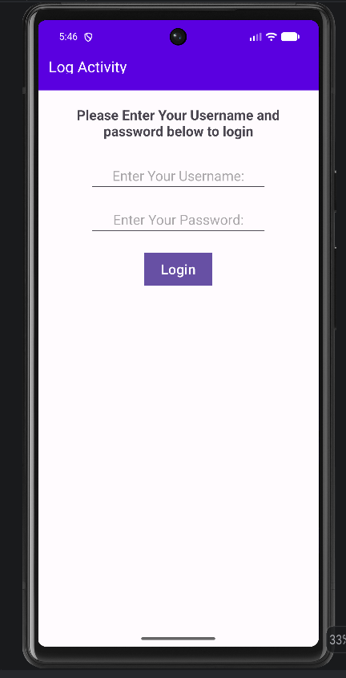
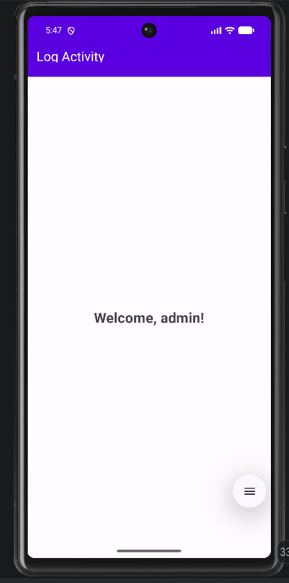
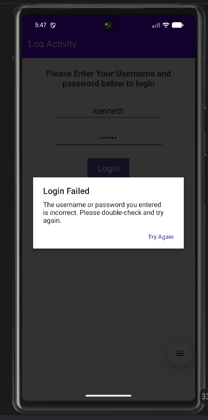

# Rosell_LogInActivity

A simple Android login demo app built with Kotlin. It demonstrates passing data between activities using `Intent` extras and handling results with the Activity Result API (`ActivityResultContracts.StartActivityForResult()`).

## Features

- Login form with username and password fields
- Empty-field validation with `Toast` message
- Credential validation in a separate `ValidationActivity`
- Success state hides the login form and shows `Welcome, {username}!`
- Login failure shows a `Login Failed` AlertDialog and clears the password field

## Screenshots

> Added screenshots to `docs/screenshots/` and update the paths below.

| Login Screen | Success | Login Failed |
|---|---|---|
|  |  |  |

## Demo Credentials

| Username | Password |
|---|---|
| `admin` | `password` |

Any other combination will trigger the Login Failed dialog.

## How It Works

1. `MainActivity` collects `username` and `password` from `etUsername` / `etPassword`.
2. On login click, it sends them via `Intent` extras to `ValidationActivity`.
3. `ValidationActivity` compares them against hardcoded `ADMIN_USERNAME = "admin"` and `ADMIN_PASSWORD = "password"`:
   - Match -> `setResult(RESULT_OK)`
   - No match -> `setResult(RESULT_CANCELED)`
4. `MainActivity` receives the result via `validationLauncher`:
   - `RESULT_OK` -> hides login views, shows `tvWelcomeMessage`
   - `RESULT_CANCELED` -> shows error dialog

Key files:
- `app/src/main/java/com/example/rosell_loginactivity/MainActivity.kt`
- `app/src/main/java/com/example/rosell_loginactivity/ValidationActivity.kt`
- `app/src/main/res/layout/activity_main.xml`
- `app/src/main/AndroidManifest.xml`

## Requirements

- Android Studio (Meerkat or newer recommended)
- JDK 11+
- Android SDK 37, `minSdk 24`
- Emulator or physical device

## How to Run

1. Clone the repo:
   ```bash
   git clone <your-repo-url>
   ```
2. Open the `Rosell_LogInActivity` folder in Android Studio.
3. Let Gradle sync finish.
4. Press **Run 'app'** (`Shift + F10`) on an emulator or device.
5. Log in with `admin` / `password`.

## Tech Stack

- Kotlin
- AndroidX: `appcompat`, `activity-ktx`, `core-ktx`, `constraintlayout`
- Material Components (`MaterialToolbar`, `Button`)
- Gradle Kotlin DSL (`build.gradle.kts`)
